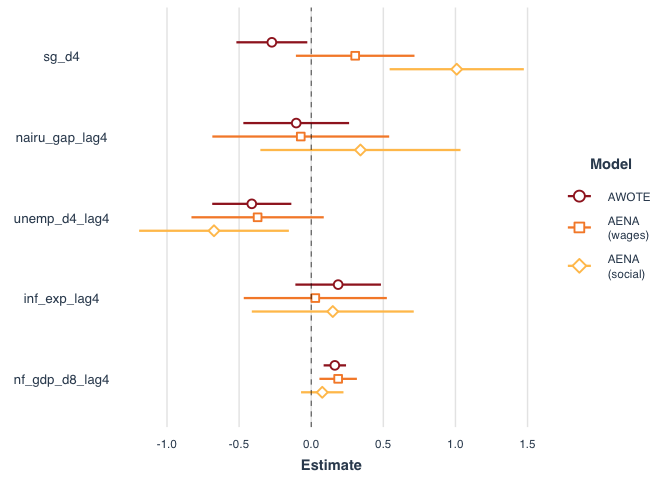
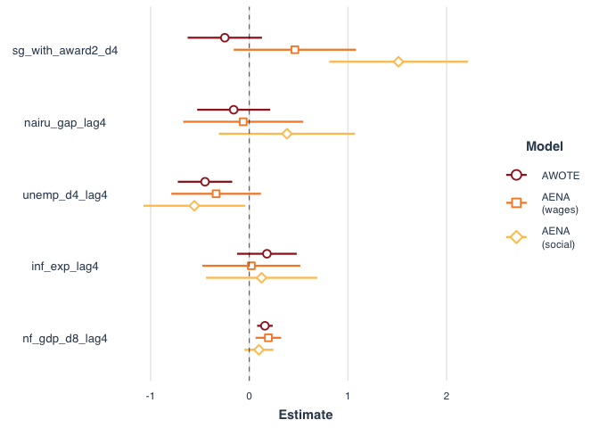
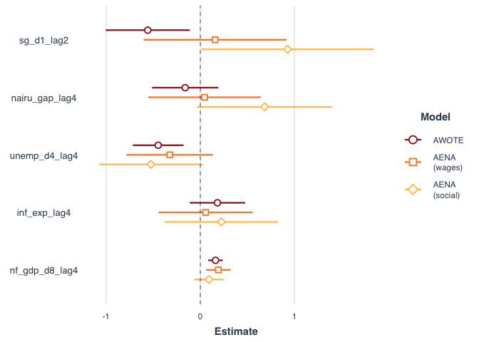
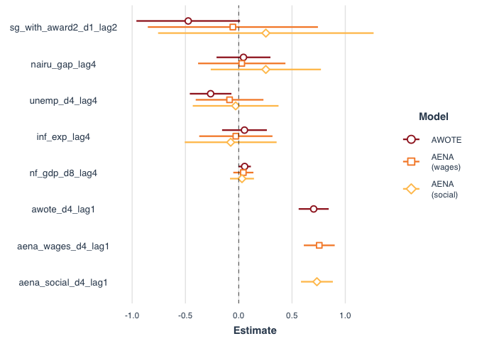

<!-- README.md is generated from README.Rmd. Please edit that file -->

# Recreating McKell Institute’s super-wages model

This repo attempts to recreate the McKell Institute’s super-wages model
presented in their 2019 research paper [*‘Does higher superannuation
reduce workers’
wages?’*](https://mckellinstitute.org.au/app/uploads/Does-higher-superannuation-reduce-wages.pdf).

It uses the statistical package R and publicly-available data. Three R
scripts are used in order:

1.  `01_get_data.R`: Retrive and tidy data from the ABS, OECD and RBA.
2.  `02_prepare_data.R`: Combine data and generate variables for the
    model set.
3.  `03_run_regressions.R`: Fit four models on each of AWOTE, AENA
    (wages) and AENA (social).

<!-- end list -->

``` r
source("R/01_get_data.R")
source("R/02_prepare_data.R")
source("R/03_run_regressions.R")
```

They compile relevant data and produce tables of regression results for
four model specifications.

The results from these regressions are summarised in the charts below.

**Model 1: Recreation of McKell models**

<!-- -->

**Model 2: McKell model with pre-SG award**

<!-- -->

**Model 3: McKell model with lagged SG one-quarter change**

<!-- -->

**Model 4: The previous model with RBA specifications**

<!-- -->
